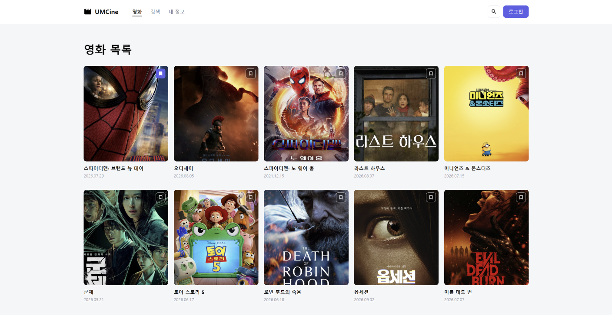
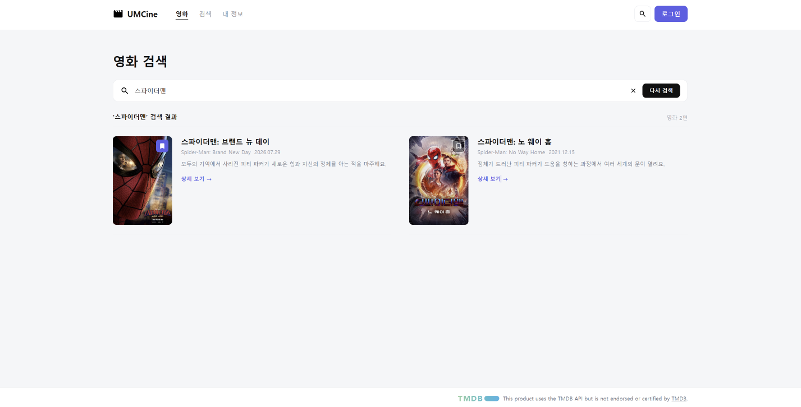
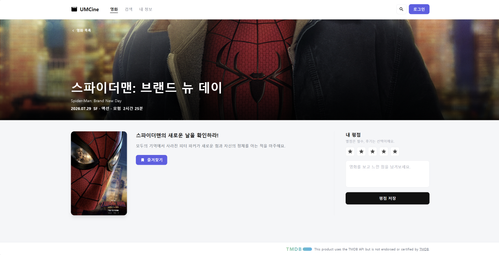
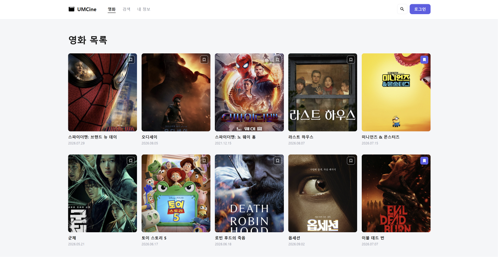
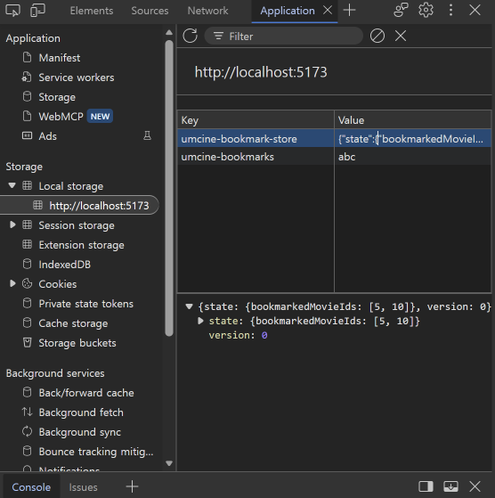

**stores/bookmark-store.ts**

```tsx
export const useBookmarkStore = create<BookmarkStore>()(
  persist(
    (set) => ({
      bookmarkedMovieIds: [],
      toggleBookmark: (movieId) =>
        set((state) => ({
          bookmarkedMovieIds: state.bookmarkedMovieIds.includes(movieId)
            ? state.bookmarkedMovieIds.filter((id) => id !== movieId)
            : [...state.bookmarkedMovieIds, movieId],
        })),
    }),
    {
      name: "umcine-bookmark-store",
      storage: createJSONStorage(() => localStorage),
      partialize: (state) => ({ bookmarkedMovieIds: state.bookmarkedMovieIds }),
    },
  ),
);
```

- 북마크 ID 배열과 그 배열을 바꾸는 toggleBookmark를 store 하나에 모았다.
- persist로 ID 배열을 localStorage에 저장하고, 앱을 다시 열 때 복원한다.

**components/bookmark-button.tsx**

```tsx
const isBookmarked = useBookmarkStore((state) => state.bookmarkedMovieIds.includes(movieId));
const toggleBookmark = useBookmarkStore((state) => state.toggleBookmark);
```

- 목록 카드, 검색 결과, 상세 화면이 모두 이 두 줄로 같은 store를 읽고 바꾼다.

---

## 실행 결과

**목록, 검색, 상세 화면이 같은 북마크 상태를 사용**







**새로고침, 브라우저 재실행 후에도 유지**


**Application 패널의 저장값**





- key: umcine-bookmark-store
- value: {"state":{"bookmarkedMovieIds":[5, 10]},"version":0}