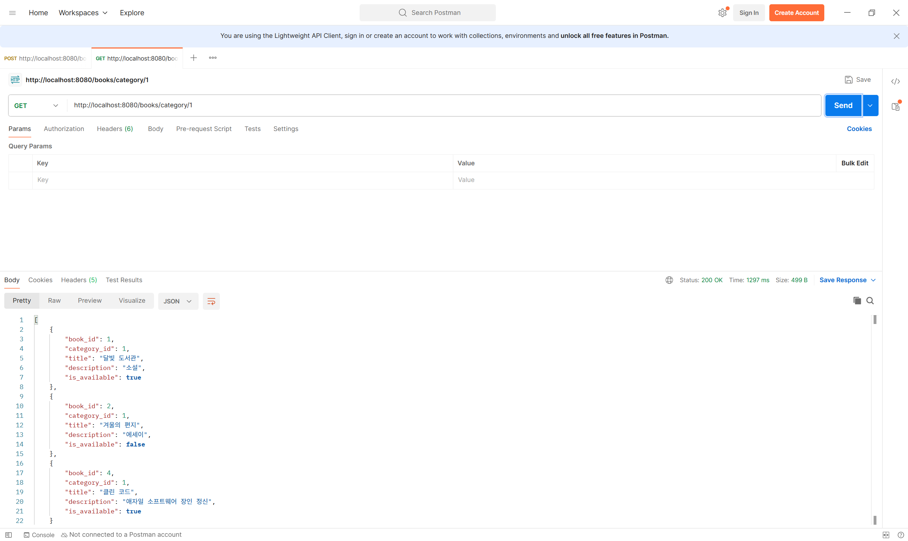
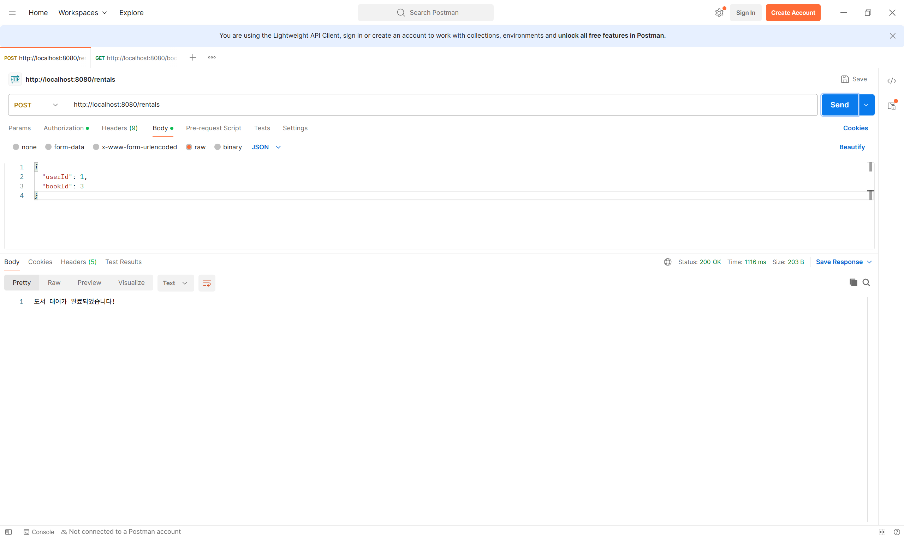
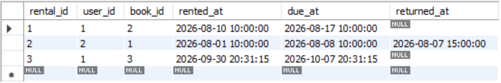

# chapter03

### 1. 특정 카테고리 도서 목록 조회 API

Path Variable로 `categoryId`를 전달받아 해당 카테고리의 도서만 조회하도록 구현했다.

#### Repository

`category_id`를 조건으로 도서를 조회하고, `?`를 사용해 파라미터를 바인딩했다.

```java
public List<Map<String, Object>> findByCategoryId(Long categoryId) {
    String sql = "SELECT * FROM book WHERE category_id = ?";

    return jdbcTemplate.queryForList(sql, categoryId);
}
```

#### Service

Controller에서 전달받은 `categoryId`를 Repository로 전달한다.

```java
public List<Map<String, Object>> getBooksByCategory(Long categoryId) {
    return bookRepository.findByCategoryId(categoryId);
}
```

#### Controller

`@PathVariable`을 사용하여 URL의 `categoryId`를 전달받도록 구현했다.

```java
@GetMapping("/category/{categoryId}")
public List<Map<String, Object>> getBooksByCategory(
        @PathVariable Long categoryId
) {
    return bookService.getBooksByCategory(categoryId);
}
```

#### 실행 결과

`GET /books/category/1`



### 2. 신규 도서 대여 기록 생성 API

Request Body로 `userId`와 `bookId`를 전달받아 새로운 대여 기록을 생성하도록 구현했다.

#### Repository

`userId`와 `bookId`를 파라미터 바인딩하여 대여 기록을 추가하고, 대여일은 현재 시간, 반납 예정일은 7일 뒤로 설정했다.

```java
public void save(Map<String, Object> body) {
    String sql = """
            INSERT INTO rental (user_id, book_id, rented_at, due_at)
            VALUES (?, ?, NOW(), DATE_ADD(NOW(), INTERVAL 7 DAY))
            """;

    jdbcTemplate.update(
            sql,
            body.get("userId"),
            body.get("bookId")
    );
}
```

#### Service

Controller에서 전달받은 요청 데이터를 Repository로 전달한다.

```java
public void createRental(Map<String, Object> body) {
    rentalRepository.save(body);
}
```

#### Controller

`@RequestBody`를 사용하여 요청으로 전달된 `userId`와 `bookId`를 받도록 구현했다.

```java
@PostMapping
public String createRental(@RequestBody Map<String, Object> body) {
    rentalService.createRental(body);
    return "도서 대여가 완료되었습니다!";
}
```

#### 실행 결과

`POST /rentals`



#### DB 확인

대여 기록이 정상적으로 저장되고, `due_at`이 `rented_at`으로부터 7일 뒤로 설정된 것을 확인했다.


