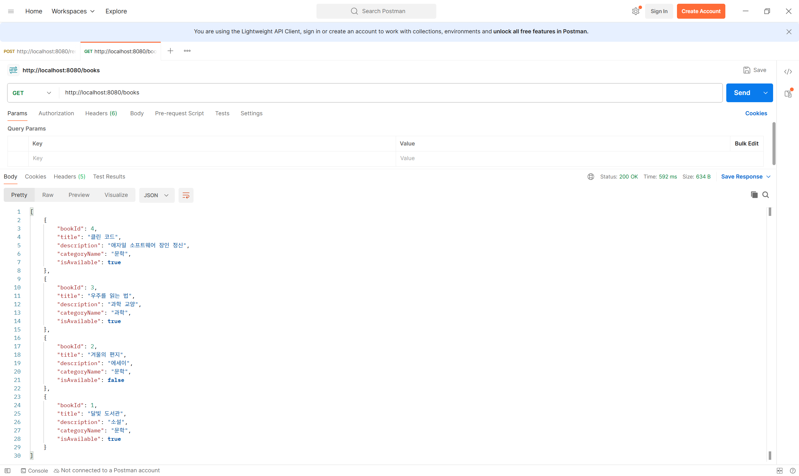
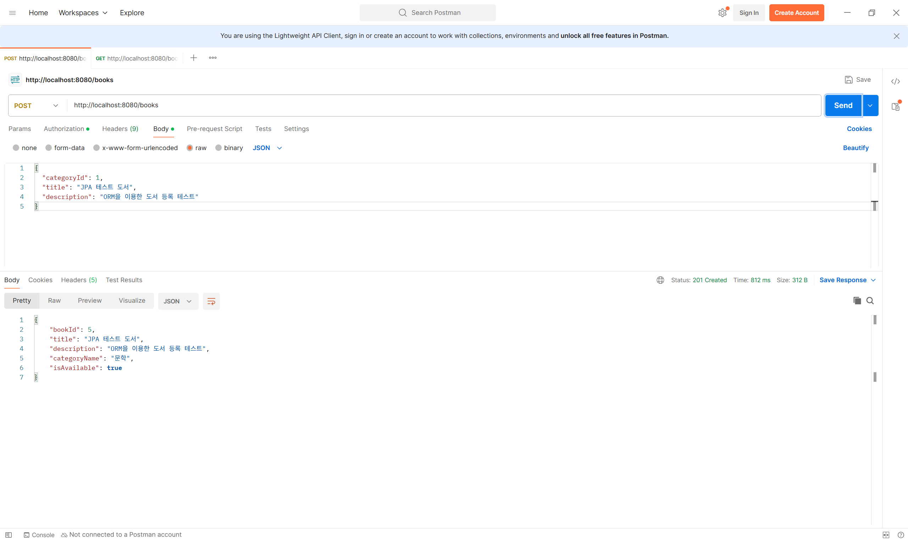
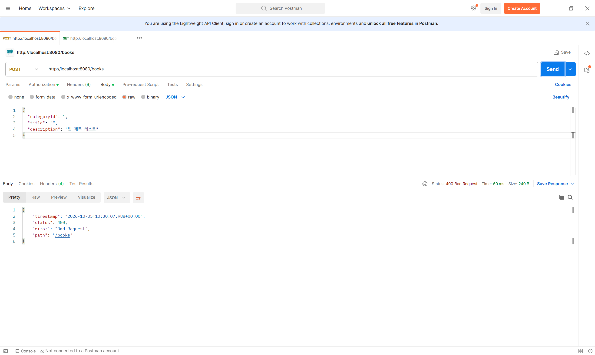
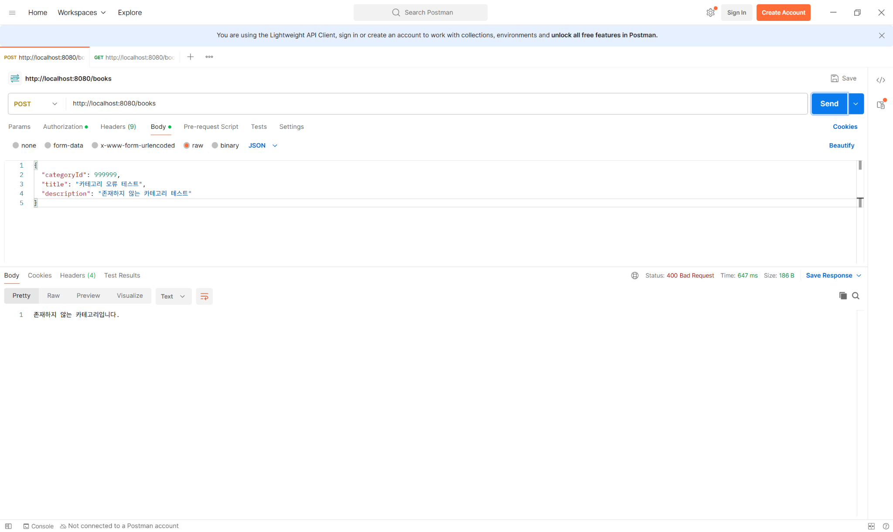

# chapter04

### 1. 구현 내용

실습 1과 실습 2를 통해 JPA를 이용한 전체 도서 목록 조회와 신규 도서 등록 기능을 구현했다.

미션에서는 실습에서 구현한 내용을 바탕으로 요구사항을 다시 확인하고, 존재하지 않는 `categoryId` 요청 시 `500 Internal Server Error`가 발생하던 부분을 추가로 수정했다.

`GlobalExceptionHandler`를 추가하여 존재하지 않는 카테고리를 요청한 경우 `400 Bad Request`와 함께 오류 메시지를 반환하도록 예외 처리를 보완했다.

### 2. Entity

`Book`과 `Category`를 Entity로 구현하고,
`Book`에서 `@ManyToOne`을 사용하여 카테고리와의 다대일 관계를 설정했다.

```java
@Entity
@Table(name = "book")
@Getter
@NoArgsConstructor(access = AccessLevel.PROTECTED)
public class Book {

    @Id
    @GeneratedValue(strategy = GenerationType.IDENTITY)
    @Column(name = "book_id")
    private Long bookId;

    @ManyToOne(fetch = FetchType.LAZY)
    @JoinColumn(name = "category_id", nullable = false)
    private Category category;

    @Column(nullable = false, length = 100)
    private String title;

    @Column(columnDefinition = "TEXT")
    private String description;

    @Column(name = "is_available", nullable = false)
    private Boolean isAvailable = true;

    public Book(Category category, String title, String description) {
        this.category = category;
        this.title = title;
        this.description = description;
    }
}
```

```java
@Entity
@Table(name = "category")
@Getter
@NoArgsConstructor(access = AccessLevel.PROTECTED)
public class Category {

    @Id
    @GeneratedValue(strategy = GenerationType.IDENTITY)
    @Column(name = "category_id")
    private Long categoryId;

    @Column(nullable = false, length = 50)
    private String name;
}
```

### 3. DTO

도서 등록 요청에는 `CreateBookRequest`를 사용하고,
`categoryId`와 `title`에 Validation을 적용했다.

조회 및 등록 결과는 `BookResponse`를 통해 반환하도록 구현했다.

```java
public record CreateBookRequest(
        @NotNull Long categoryId,
        @NotBlank @Size(max = 100) String title,
        String description
) {
}
```

```java
public record BookResponse(
        Long bookId,
        String title,
        String description,
        String categoryName,
        Boolean isAvailable
) {
    public static BookResponse from(Book book) {
        return new BookResponse(
                book.getBookId(),
                book.getTitle(),
                book.getDescription(),
                book.getCategory().getName(),
                book.getIsAvailable()
        );
    }
}
```

### 4. Repository

Spring Data JPA의 `JpaRepository`를 사용하여 데이터베이스에 접근하도록 구현했다.

```java
public interface BookRepository extends JpaRepository<Book, Long> {
    List<Book> findAllByOrderByBookIdDesc();
}
```

```java
public interface CategoryRepository extends JpaRepository<Category, Long> {
}
```

### 5. Service

전체 도서는 `bookId`를 기준으로 내림차순 조회하고,
조회된 Entity를 `BookResponse`로 변환하도록 구현했다.

도서 등록 시에는 먼저 `categoryId`에 해당하는 카테고리를 조회한 뒤,
카테고리가 존재하는 경우에만 새로운 도서를 저장하도록 구현했다.

```java
@Service
@RequiredArgsConstructor
public class BookService {

    private final BookRepository bookRepository;
    private final CategoryRepository categoryRepository;

    // 도서를 최신 등록순으로 조회하고 응답 DTO로 변환
    @Transactional(readOnly = true)
    public List<BookResponse> getBooks() {
        return bookRepository.findAllByOrderByBookIdDesc().stream()
                .map(BookResponse::from)
                .toList();
    }

    // 카테고리를 확인한 후 신규 도서를 저장하고 응답 DTO로 변환
    @Transactional
    public BookResponse createBook(CreateBookRequest request) {
        Category category = categoryRepository.findById(request.categoryId())
                .orElseThrow(() ->
                        new IllegalArgumentException("존재하지 않는 카테고리입니다."));

        Book book = new Book(
                category,
                request.title(),
                request.description()
        );

        return BookResponse.from(bookRepository.save(book));
    }
}
```

### 6. Controller

`GET /books`를 통해 전체 도서를 조회하고,
`POST /books`를 통해 새로운 도서를 등록하도록 구현했다.

도서 등록 시 `@Valid`를 적용하여 DTO의 Validation이 동작하도록 했으며,
정상적으로 등록된 경우 `201 Created`를 반환하도록 설정했다.

```java
@RestController
@RequestMapping("/books")
@RequiredArgsConstructor
public class BookController {

    private final BookService bookService;

    // 전체 도서 목록 조회
    @GetMapping
    public List<BookResponse> getBooks() {
        return bookService.getBooks();
    }

    // 신규 도서 등록
    @PostMapping
    @ResponseStatus(HttpStatus.CREATED)
    public BookResponse createBook(
            @Valid @RequestBody CreateBookRequest request
    ) {
        return bookService.createBook(request);
    }
}
```

### 7. 실행 결과

#### GET /books - 전체 도서 목록 조회

전체 도서가 최신순으로 조회되고 `200 OK`가 반환되는 것을 확인했다.



#### POST /books - 신규 도서 등록

새로운 도서가 정상적으로 등록되고 `201 Created`가 반환되는 것을 확인했다.



#### POST /books - 빈 제목 요청

빈 제목으로 요청한 경우 DTO의 `@NotBlank` 검증을 통해
`400 Bad Request`가 반환되는 것을 확인했다.



### 8. 존재하지 않는 카테고리 예외 처리 추가

실습에서는 존재하지 않는 `categoryId`를 요청하면
`IllegalArgumentException`이 처리되지 않아 `500 Internal Server Error`가 반환되었다.

미션에서는 잘못된 `categoryId`가 서버 내부 오류로 처리되지 않도록
`GlobalExceptionHandler`를 추가했다.

`IllegalArgumentException`이 발생하면 `400 Bad Request`와 함께
예외 메시지를 반환하도록 구현했다.

```java
@RestControllerAdvice
public class GlobalExceptionHandler {

    // 잘못된 요청으로 발생한 예외를 400 Bad Request로 처리
    @ExceptionHandler(IllegalArgumentException.class)
    @ResponseStatus(HttpStatus.BAD_REQUEST)
    public String handleIllegalArgumentException(IllegalArgumentException e) {
        return e.getMessage();
    }
}
```

#### POST /books - 존재하지 않는 카테고리 요청

존재하지 않는 `categoryId`로 요청한 결과
`400 Bad Request`와 `"존재하지 않는 카테고리입니다."` 메시지가 반환되는 것을 확인했다.



### 9. 3주차 Raw SQL 방식과 비교해 바뀐 점

3주차에서는 `JdbcTemplate`을 사용하여 SQL문을 직접 작성하고 데이터베이스에 접근했지만, 4주차에서는 JPA의 Entity와 Repository를 사용하여 데이터베이스에 접근하도록 변경했다.

기존에는 조회 결과와 요청 데이터를 `Map<String, Object>` 형태로 처리했지만, 4주차에서는 `CreateBookRequest`와 `BookResponse` DTO를 사용하여 요청과 응답의 데이터 구조를 명확하게 구분했다.

또한 `book`과 `category`의 관계를 SQL에서 직접 처리하는 대신 `@ManyToOne`과 `@JoinColumn`을 사용하여 Entity 간의 연관관계로 표현했다.

도서 등록 시에도 SQL의 `INSERT`문을 직접 작성하는 대신 `bookRepository.save()`를 사용하여 Entity를 저장하도록 변경했다.

### 10. 실행 결과 검증

`GET /books`의 최신순 도서 조회, `POST /books`의 신규 도서 등록 및 201 응답, DTO 요청값 검증과 존재하지 않는 카테고리의 예외 처리가 모두 요구사항에 맞게 동작하는 것을 확인했다.
