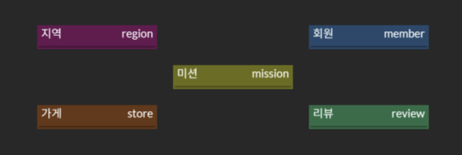
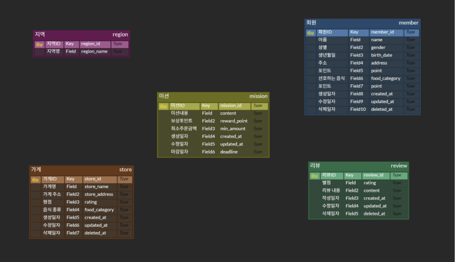
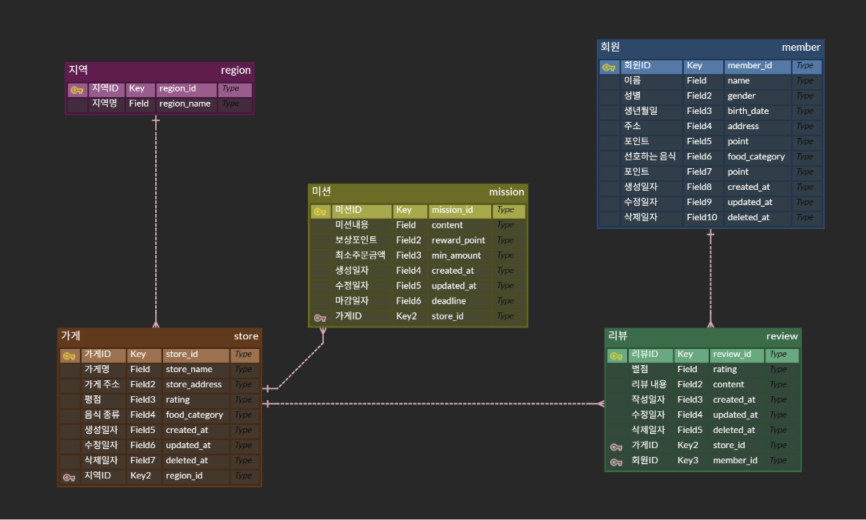
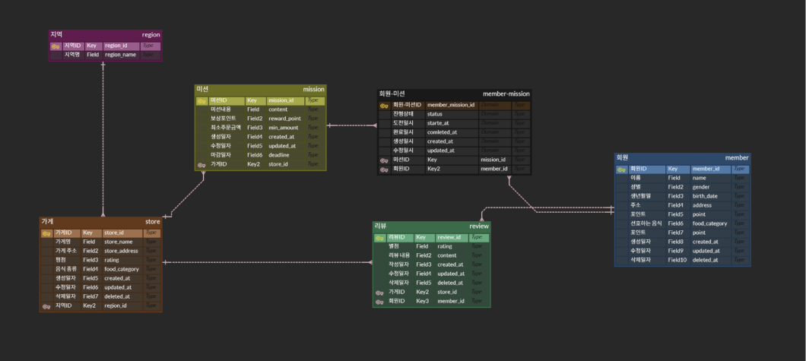
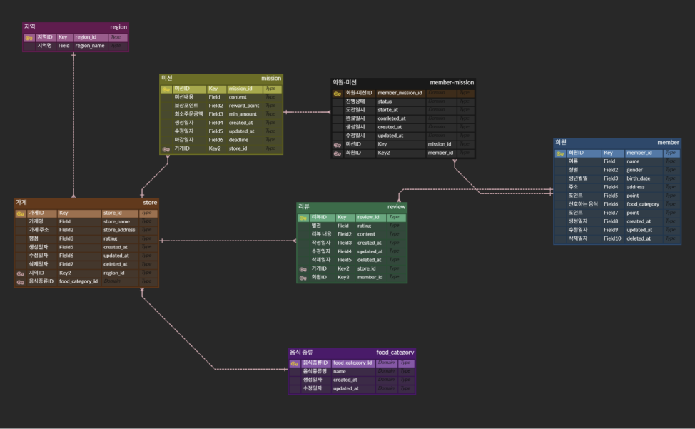
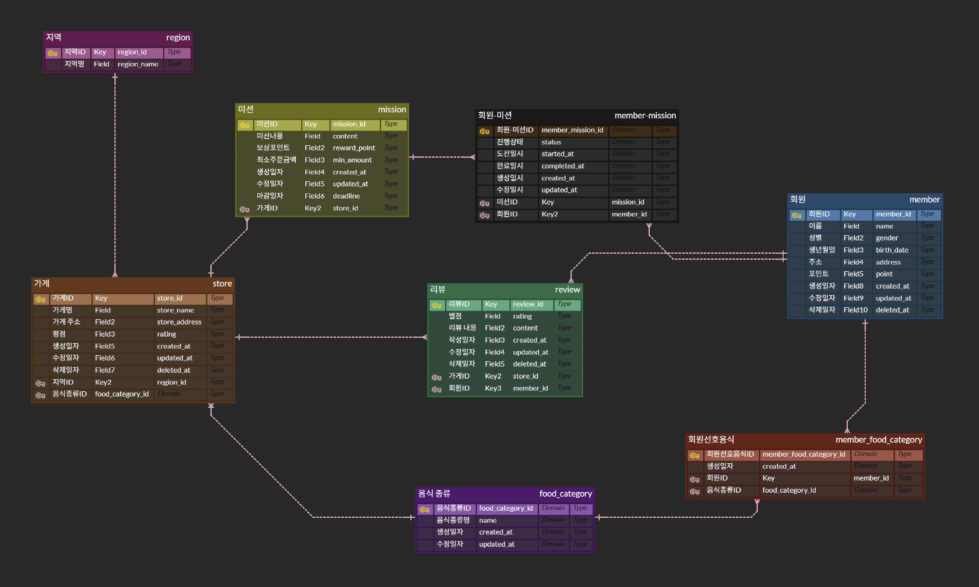
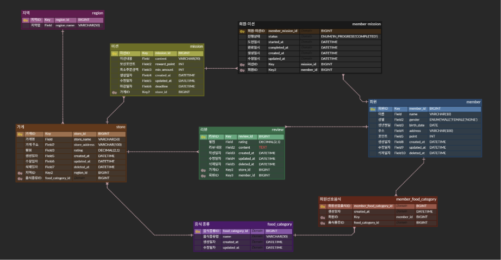
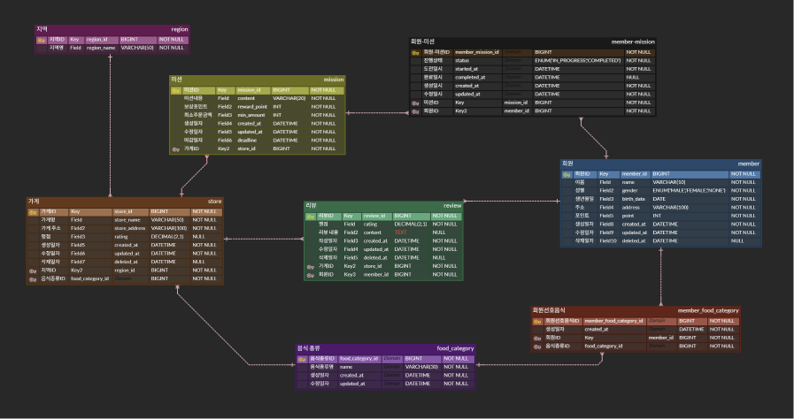
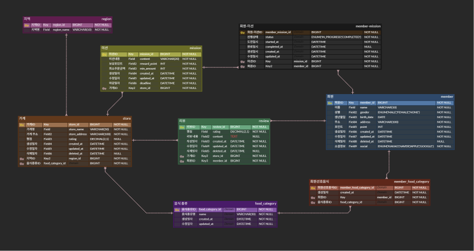

- **미션 기록**

  ERD 사진

  

  설명

    <aside>

  [서비스 요약]과 기획플로우, 와이어프레임을 참고하여 지역, 가게, 미션, 회원, 리뷰 라는 5개의 큰 테이블로 시작

    </aside>

  ERD 사진

  

  설명

    <aside>

  와이어프레임에 나오는 화면별로 컬럼을 도출

    - 회원가입 화면 - member(이름, 성별, 생년월일, 주소, 선호하는 음식, 포인트)
    - 홈 화면 상단 - region(지역명)
    - 가게 상세 화면 - store(가게명, 주소, 평점, 음식 종류)
    - 미션 카드 - mission(미션내용, 보상포인트, 최소주문금액, 마감일자)
    - 리뷰 목록 - review(별점, 리뷰내용)
    - Soft Delete를 고려해 삭제일자를 컬럼에 추가
    </aside>

  ERD 사진

  

  설명

    <aside>

  1:N 관계인 테이블을 모두 연결
    * FK를 1쪽에 두면 한 칸에 값이 여러 개가 들어가게 되어 제1 정규화 위반이므로 N쪽에 두어야함

    </aside>

  ERD 사진

  

  설명

    <aside>

  “회원”과 “미션”은 N:M 관계이므로 중간 테이블인 “회원-미션”을 만들어 1:N 두 개로 분해

    </aside>

  ERD 사진

  

  설명

    <aside>

  회원가입 화면의 선호 음식 목록과 가게의 음식 종류가 동일한 목록이므로 “음식 종류” 라는 하나의 테이블로 분리

    </aside>

  ERD 사진

  

  설명

    <aside>

  음식 종류와 회원은 N:M 관계이므로 “회원선호음식” 이라는 중간테이블을 생성하여 1:N 두 개로 분해

    </aside>

  ERD 사진

  

  설명

    <aside>

  타입 지정

  PK ,FK- Auto Increment로 계속 올라가기 때문에 bigint로 설정

  point, reward_point, min_amount - int로 설정

  rating - 소수로 표시해야 해서 DECIMAL로 설정

  name, address, content - 길이가 예측 되므로 VARCHAR로 설정
  *review.content는 예측X라 TEXT로 설정

  birth_date - DATE로 설정

  created_at, deleted_at, updated_at, completed_at - 몇 시인지 알아야 해서 DATETIME으로 설정

  gender, status, social - ENUM으로 선택지 제한

    </aside>

  ERD 사진

  

  설명

    <aside>

  제약조건 지정

  NULL 판단 기준

    1. 구조상 필수인지
       PK,FK,생성일시는 없으면 데이터 성립  X
    2. 화면에서 필수로 입력해야 하는지
       와이어프레임을 보고 입력 없이 다음 단계로 갈 수 있는지 판단
    3. NULL이 의미를 가지는지
       deleted_at은 null이 “활동중”을 의미
       completed_at은 null이 “진행중”을 의미
     </aside>

   ERD 사진

   

   설명

     <aside>

   +누락된 소셜 정보를 회원 테이블에 추가

     </aside>