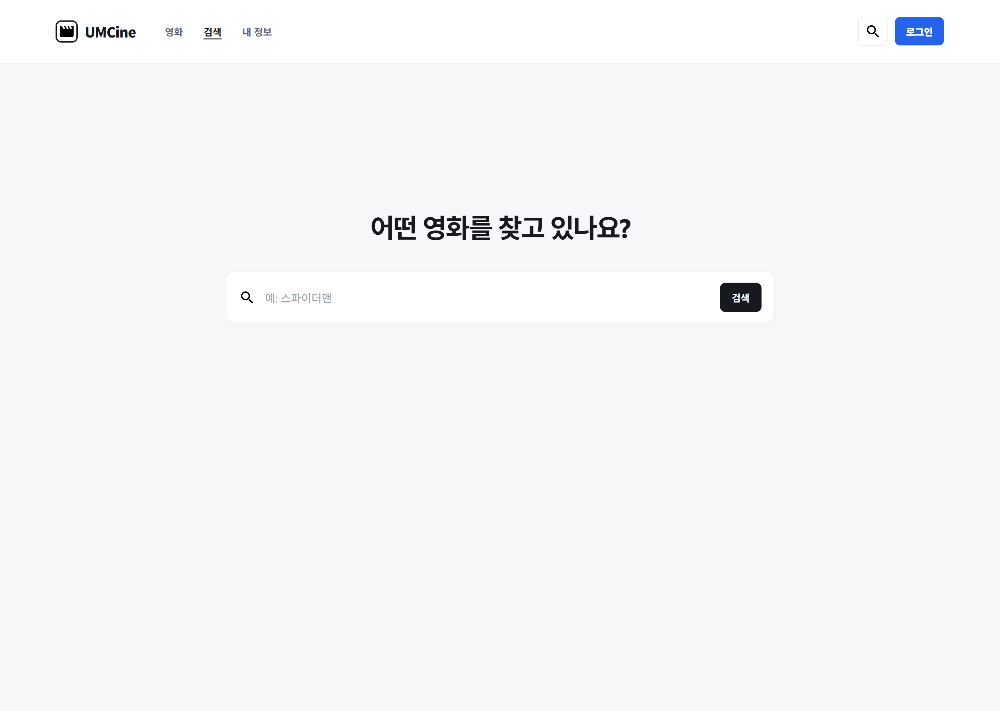
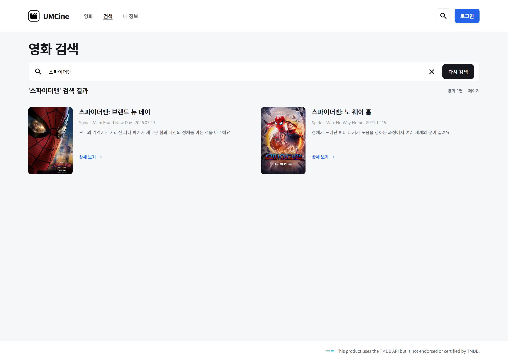

# chapter03

## 1. 구현 방법

### 영화 검색 화면

TanStack Router를 사용하여 `/search` 경로에 영화 검색 화면을 구현했다.

검색어를 입력하고 검색 버튼을 누르면 입력한 검색어를 `query`로 전달하여
`/search?query=검색어` 형태의 URL로 이동하도록 구현했다.

```tsx
export const Route = createFileRoute("/search")({
  validateSearch: (search): { query?: string } => ({
    query: typeof search.query === "string" ? search.query : undefined,
  }),
  component: SearchPage,
});
```

검색 버튼을 누르면 입력된 검색어의 앞뒤 공백을 제거한 뒤 Search Param으로 전달하도록 구현했다.

```tsx
function handleSubmit(event: SubmitEvent<HTMLFormElement>) {
  event.preventDefault();

  const nextQuery = searchText.trim();

  navigate({
    search: nextQuery ? { query: nextQuery } : {},
  });
}
```

검색어가 없는 경우에는 영화 검색 입력창을 표시하고,
검색어가 존재하는 경우에는 제공된 로컬 영화 데이터에서 제목 또는 영문 제목에
검색어가 포함된 영화를 찾아 검색 결과를 표시하도록 구현했다.

```tsx
const normalizedQuery = query?.trim().toLowerCase() ?? "";

const searchResults = normalizedQuery
  ? movies.filter(
      (movie) =>
        movie.title.toLowerCase().includes(normalizedQuery) ||
        movie.originalTitle.toLowerCase().includes(normalizedQuery),
    )
  : [];
```

검색 결과에는 영화의 포스터, 제목, 영문 제목, 개봉일, 줄거리를 표시했으며,
`상세 보기`를 누르면 해당 영화의 상세 페이지로 이동하도록 구현했다.

```tsx
<Link
  to="/movies/$movieId"
  params={{ movieId: String(movie.id) }}
>
  상세 보기
</Link>
```

검색 결과가 없는 경우에는 검색 결과가 없다는 안내 문구를 표시하도록 구현했다.

### 영화 상세 화면

`/movies/$movieId` 경로에 영화 상세 화면을 구현했다.

```tsx
export const Route = createFileRoute("/movies/$movieId")({
  component: MovieDetailPage,
});
```

URL의 `movieId` 값을 가져와 제공된 로컬 영화 데이터에서
해당 ID를 가진 영화를 찾아 화면에 표시하도록 구현했다.

```tsx
const { movieId } = useParams({ from: "/movies/$movieId" });

const movie = movies.find(
  (item) => item.id === Number(movieId),
);
```

상세 화면에는 영화의 배경 이미지, 포스터, 제목, 영문 제목, 개봉일,
장르, 러닝타임, 줄거리 등의 정보를 표시했다.

존재하지 않는 `movieId`로 접근한 경우에는
`영화를 찾을 수 없어요.`라는 안내 문구를 표시하도록 구현했다.

```tsx
if (!movie) {
  return <main>영화를 찾을 수 없어요.</main>;
}
```

또한 영화 목록과 검색 결과에서 각 영화의 상세 화면으로 이동할 수 있도록
라우팅을 연결했다.

### Tailwind CSS 적용

기존 CSS로 작성되어 있던 공개 영화 화면의 스타일을 Tailwind CSS로 변경했다.

Figma의 데스크톱 화면과 비교하면서 영화 목록, 검색, 검색 결과,
상세 화면의 크기, 간격, 배경색 등을 Tailwind CSS 클래스로 구현했다.

예를 들어 검색 버튼의 크기, 배경색, 여백과 글자 스타일을 Tailwind CSS 클래스로 적용했다.

```tsx
<button
  type="submit"
  className="ml-[14px] h-[42px] rounded-lg bg-[#17191e] px-[17px] text-sm font-bold text-white"
>
  검색
</button>
```

상태에 따라 달라지는 클래스는 `cn` 함수를 이용해 조합하도록 구현했다.

```tsx
import { clsx, type ClassValue } from "clsx";
import { twMerge } from "tailwind-merge";

export function cn(...inputs: ClassValue[]) {
  return twMerge(clsx(inputs));
}
```

## 2. 실행 결과

### 영화 검색 화면



### 영화 검색 결과 화면



### 영화 상세 화면


