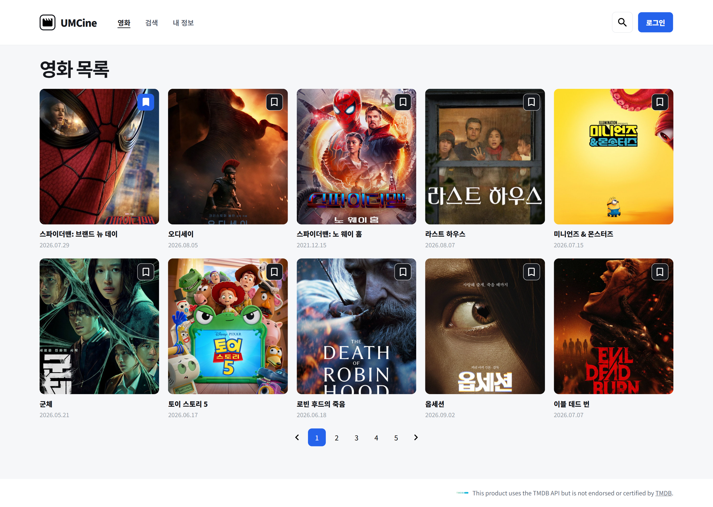
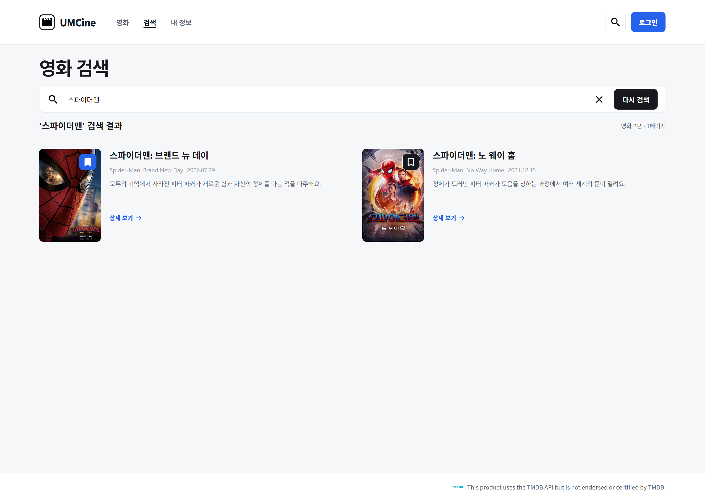
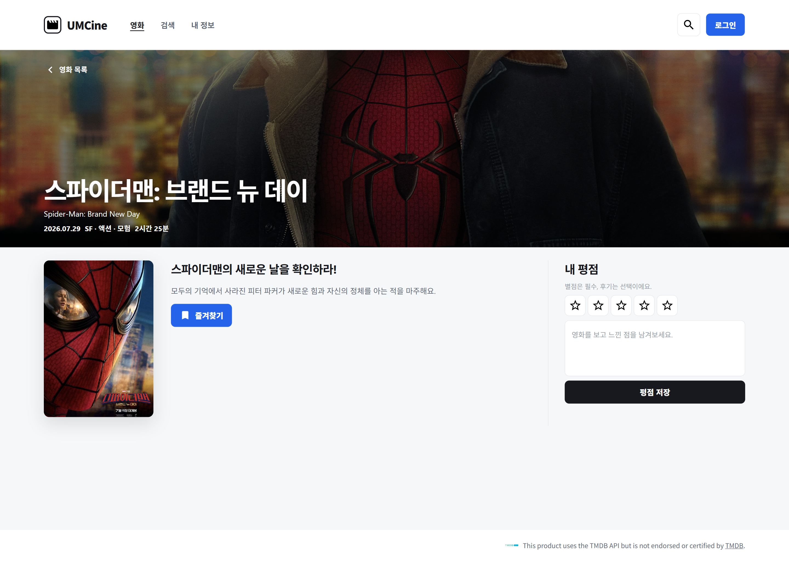
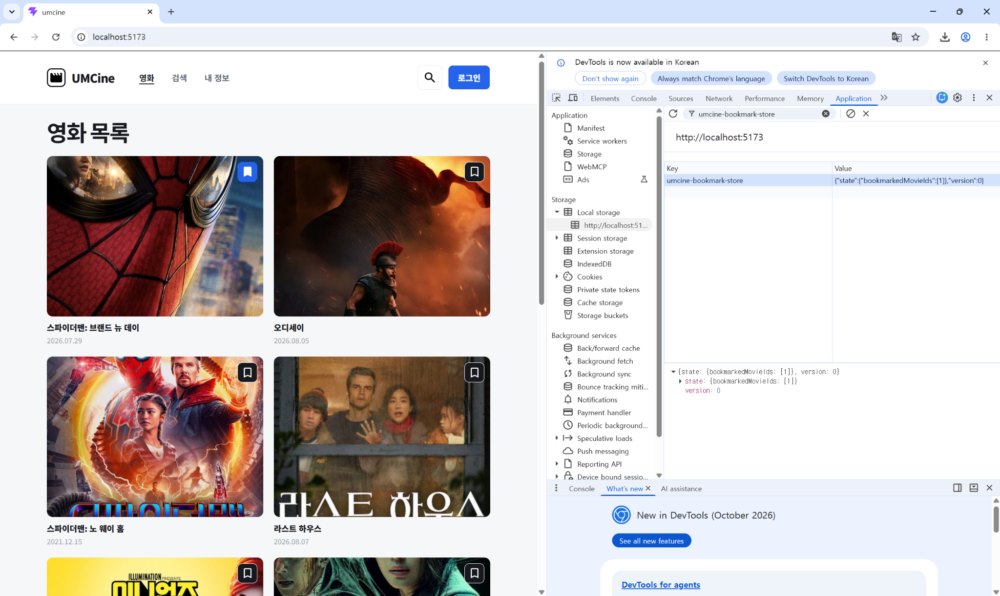

# chapter04

## 1. 구현 방법

### Zustand를 이용한 북마크 상태 관리

목록, 검색, 상세 화면에서 동일한 북마크 상태를 사용할 수 있도록 Zustand store를 구현했다.

`bookmarkedMovieIds`에 북마크한 영화의 ID를 저장하고, `toggleBookmark`를 통해 해당 영화가 이미 북마크되어 있으면 제거하고, 북마크되어 있지 않으면 추가하도록 구현했다.

```tsx
bookmarkedMovieIds: [],

toggleBookmark: (movieId) =>
  set((state) => ({
    bookmarkedMovieIds: state.bookmarkedMovieIds.includes(movieId)
      ? state.bookmarkedMovieIds.filter((id) => id !== movieId)
      : [...state.bookmarkedMovieIds, movieId],
  })),
```

### 목록, 검색, 상세 화면 북마크 상태 공유

목록 화면에서는 `BookmarkButton` 컴포넌트에서 Zustand store를 사용하여 현재 영화의 북마크 여부를 확인하고, `toggleBookmark`를 통해 북마크 상태를 변경하도록 구현했다.

```tsx
const isBookmarked = useBookmarkStore((state) =>
  state.bookmarkedMovieIds.includes(movieId),
);

const toggleBookmark = useBookmarkStore(
  (state) => state.toggleBookmark,
);
```

기존 검색 화면은 검색어 입력 화면과 검색 결과 화면으로 구성되어 있으며, 검색 결과에는 별도의 북마크 기능이 없었다.

이번 미션에서 검색 화면에서도 동일한 북마크 상태를 확인하고 변경할 수 있도록 검색 결과의 영화 포스터에 `BookmarkButton`을 추가했다.

```tsx
<div className="relative h-[190px] w-[126px] shrink-0">
  

  <BookmarkButton movieId={movie.id} />
</div>
```

상세 화면에서는 기존의 `즐겨찾기` 버튼에 동일한 Zustand store를 연결하여 북마크를 추가하거나 제거할 수 있도록 구현했다. 기존 디자인을 유지하기 위해 버튼 문구는 `즐겨찾기`로 유지하고, 북마크 여부에 따라 아이콘이 변경되도록 구현했다.

이를 통해 목록, 검색 결과, 상세 화면 중 어느 화면에서 북마크 상태를 변경하더라도 다른 화면에서 동일한 상태가 표시되도록 구현했다.

### Web Storage를 이용한 북마크 상태 유지

Zustand의 `persist` 미들웨어와 `localStorage`를 사용하여 북마크 상태가 브라우저에 저장되도록 구현했다.

저장소의 key는 `umcine-bookmark-store`로 설정했으며, 북마크한 영화의 ID가 담긴 `bookmarkedMovieIds`가 저장되도록 설정했다.

```tsx
{
  name: "umcine-bookmark-store",
  storage: createJSONStorage(() => localStorage),
  partialize: (state) => ({
    bookmarkedMovieIds: state.bookmarkedMovieIds,
  }),
}
```

이를 통해 페이지를 새로고침하거나 브라우저를 종료한 뒤 다시 실행하더라도 저장된 북마크 상태가 복원되도록 구현했다.

## 2. 실행 결과

### 목록, 검색, 상세 화면 북마크 연동

`스파이더맨: 브랜든 뉴 데이`를 북마크한 뒤, 목록·검색 결과·상세 화면에서 동일한 북마크 상태가 유지되는지 확인했다.

**목록 화면**

목록 화면에서 `스파이더맨: 브랜든 뉴 데이`를 북마크한 상태이다.



**검색 결과 화면**

`스파이더맨`을 검색한 결과에서도 `스파이더맨: 브랜든 뉴 데이`가 동일하게 북마크된 상태로 표시되는 것을 확인했다.



**상세 화면**

해당 영화의 상세 화면으로 이동한 뒤에도 즐겨찾기 상태가 동일하게 유지되는 것을 확인했다.



이를 통해 목록, 검색 결과, 상세 화면이 동일한 북마크 상태를 공유하며, 한 화면에서 변경한 상태가 다른 화면에도 동일하게 반영되는 것을 확인했다.

### Web Storage 저장 및 복원 확인

Application 패널의 Local Storage에서 `umcine-bookmark-store`에 북마크한 영화 ID가 저장되는 것을 확인했다.



페이지를 새로고침한 뒤에도 북마크 상태가 유지되는 것을 확인했으며, 브라우저를 종료한 뒤 다시 실행했을 때도 저장된 북마크 상태가 정상적으로 복원되는 것을 확인했다.

또한 Application 패널에서 `umcine-bookmark-store` 저장값을 삭제한 뒤 새로고침했을 때 모든 북마크가 해제된 초기 상태로 돌아오는 것을 확인했다.

