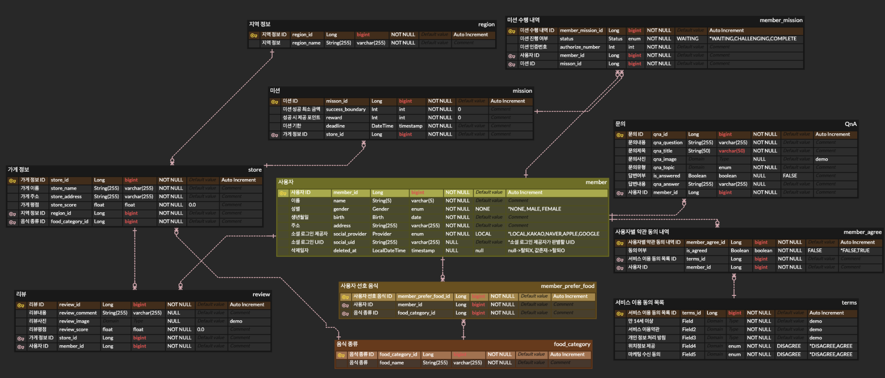

- **미션 기록**
    
    ERD 사진
    
    
    
    설명
    
    - 전체적으로 M:N 관계를 중간 테이블을 통해 구현하는 것을 기억하고, 첨부 파일과 요구사항을 읽으면서 디자이너의 의도에 맞는 테이블 설계를 하기 위해 의도 파악하는 데 집중했다. 빠르게 기본적인 ERD 구현 후 세부사항들을 논의하며 조정하는 점, 그리고 기존 경험에 뒷받침해 사용자 친화적인 서비스를 만드는 점에도 연결될 것 같다
    - 사용자: 실습과 비슷하되 필수적인 정보만 테이블에 기입하였다. 소셜 로그인 제공자를 늘리고, 탈퇴 기능이 있음에 따라 soft delete를 고려하여 삭제일자도 만들었다. 보통 주소를 입력할 때 정해진 주소를 찾고(우편번호 기반), 세부주소를 추가로 기입하는데, 이는 하나로 저장하는 지 찾아볼 필요가 있다.
    - 사용자 선호 음식 - 음식 종류
    - 문의: 문의 리스트에 사용자 ID를 FK로 두고 default를 false로 하는 답변여부와 답변내용 등을 넣었다. 조사 시 문의사진은 따로 테이블을 두는 것을 추천하여 이는 더 찾아볼 필요가 있다.
    - 사용자별 약관 동의 내역 - 서비스 이용 동의 목록: M:N 관계를 위한 중간 테이블이 있고, 초기 사용자가 가입할 때 누르는 약관 동의 내역이다. (알림 설정과 다름) 이때 필수적으로 눌러야 가입이 진행되는 동의 내용들을 테이블에 저장할 것인가?에 대한 고민이 있는데 안누르면 못 가는 것이니 저장할 필요가 있나 싶지만 이는 명백히 동의여부를 저장하는 것이기에 필요하지 않나 싶다. 그리고 여기서의 마케팅 수신 동의와 앱 설정의 알림 수신 설정이 보통 동일한 것인데 요구사항에는 둘의 단어가 달라 고민이 있다. 그리고 아이폰에서 위치정보 제공의 경우 폰의 설정에서 조작할 수 있는데 이런 점은 어떻게 저장하는지 찾아볼 필요가 있다.
    - 미션 - 미션 수행 내역: 사용자별 맞춤 미션 제공이 아닌 여러가지의 미션이 존재하고 각 사용자에게는 status로 참여전/참여중/참여완료로 구별되어 이에 따라 화면 표시도 다르게 되는 것으로 이해하였다. 미션 성공 최고 금액, 성공 시 제공 포인트의 경우 미션의 내용이 통일(일정 금액 이상 구매 & 정수 포인트 제공 ex 10,000)이라고 가정 후 작성하였는데, 미션 내용이 금액이 아니라 지시문이거나 다른 예시화면처럼 성공 시 제공 포인트가 %일 경우라면 테이블 작성을 다시 해야 하고, 이럴땐 어떻게 해야할지 찾아볼 필요가 있다.
    - 지역 정보 - 가게 정보 - 리뷰 : 가게정보의 가게평점을 따로 저장을 해놓을지 아니면 리뷰의 해당 매장 리뷰 스코어를 매번 계산하여 보여줄지 고민이 있다.
    - 궁금증 해소 및 발전을 위해 위 내용을 더 파악해보고 공유할 필요가 있으며, 다음 스터디에는 해당 부분까지 해소하여 참여해야겠다.


- 필수 미션
    
    ```markdown
    "use strict";
    // 회원의 ID, 이름, 역할과 선택 값인 GitHub 아이디를 타입으로 표현하고,
    // 서로 다른 정보를 가진 회원 두 명 이상을 작성해요.
    type Member = {
        id: string;
        name: string;
        role: string;
        githubId?: string;
    };

    const dohun: Member = {
        id: "1",
        name: "도훈",
        role: "leader",
        githubId: "dohun415",
    };
    const minki: Member = {
        id: "2",
        name: "민기",
        role: "member",
    };
    const members: Member[] = [dohun, minki];

    function checkMember(id: string): Member | null {
        const member = members.find((m) => m.id === id);
        return member ?? null;
    }

    function printMessage(id: string) {
        const member = checkMember(id);
        if (member === null) {
            console.log(`[ID: ${id}] 회원을 찾을 수 없습니다: null`);
            return;
        }

        const githubText = member.githubId ? `GitHub: ${member.githubId}` : "GitHub: 없음";
        console.log(`[ID: ${member.id}] 이름: ${member.name}, 역할: ${member.role}, ${githubText}`);
    }

    printMessage("1");
    printMessage("2");
    printMessage("999");
    ```

    